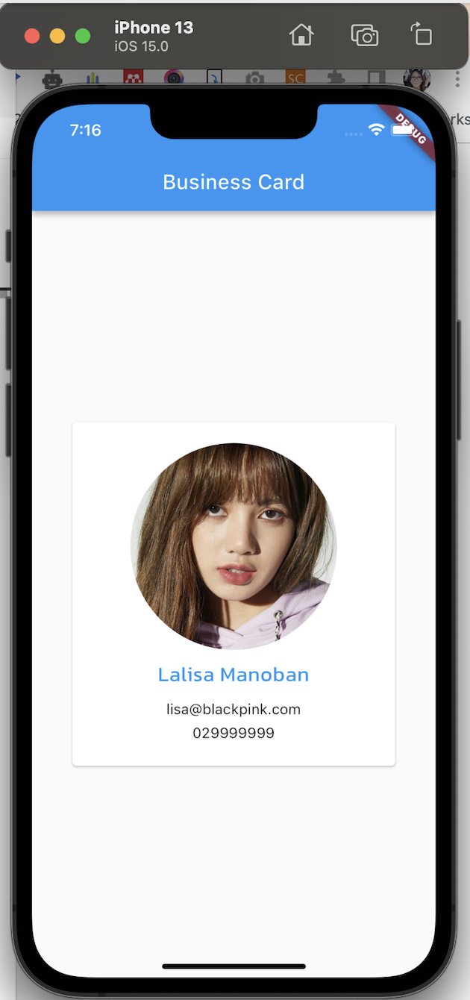

# responsivedemo

## Responsive Builder

### Portrait

### Lanscape

Source: https://pub.dev/packages/responsive_builder

## Getting Started

main.dart

`
import 'package:flutter/material.dart';
import 'package:responsive_builder/responsive_builder.dart';
import 'package:responsivedemo/businesscard.dart';
import 'package:responsivedemo/landscapebusinesscard.dart';

void main() {
runApp(const MyApp());
}

class MyApp extends StatelessWidget {
const MyApp({Key? key}) : super(key: key);

// This widget is the root of your application.
@override
Widget build(BuildContext context) {
return MaterialApp(
home: OrientationLayoutBuilder(
portrait: (context) => const BusinessCard(),
landscape: (context) => const LandScapeBusinessCard(),
),
);
}
}
`
